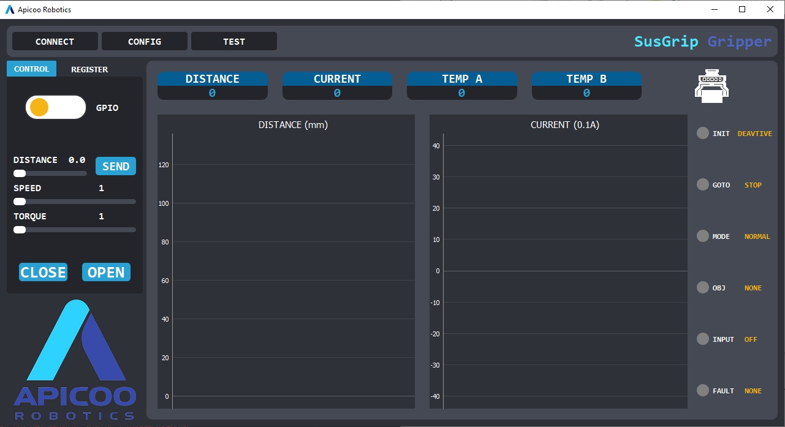

# 1. GUI




# 2. INSTALL

## 2.1. Python
[Python 3.10.1](https://www.python.org/downloads/release/python-3101/)
## 2.2. Packages
```sh
    pip install -r requirements.txt
```
# 3. RUN
The command is run in windows 10
```sh
    python main.py
```